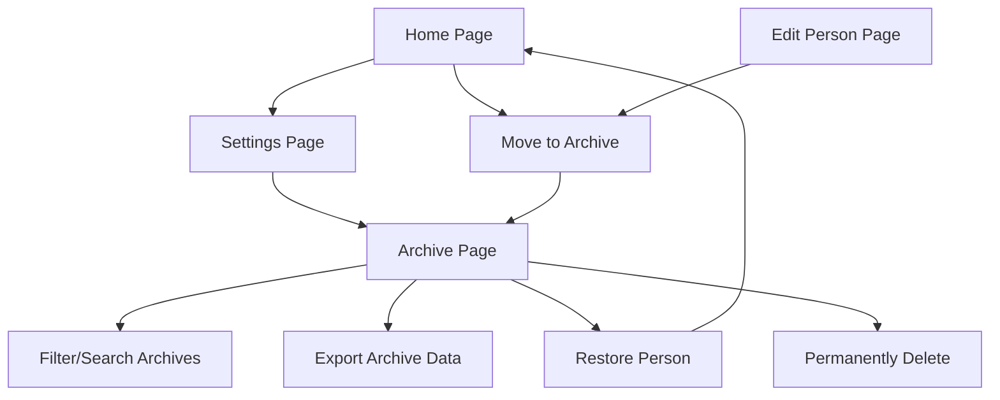

## 1. Product Overview
Implement a comprehensive archive system for the Human Data Center application that allows users to archive personnel records instead of permanently deleting them, with full archive management capabilities including viewing, filtering, exporting, restoring, and permanent deletion.

- The system will maintain data separation between active and archived personnel for future export capabilities while providing seamless archive operations through a dedicated interface accessible from settings.
- This feature addresses data retention requirements and provides administrators with better control over personnel data lifecycle management.

## 2. Core Features

### 2.1 User Roles
No additional user roles required - the archive system will be accessible to all existing users through the settings page.

### 2.2 Feature Module
Our archive system requirements consist of the following main components:
1. **Archive Database Management**: separate database logic for archived personnel with archival timestamp
2. **Archive Page**: dedicated interface for viewing and managing archived personnel
3. **Archive Operations**: move to archive, restore from archive, and permanent delete functionality
4. **Settings Integration**: archive page access through existing settings interface

### 2.3 Page Details

| Page Name | Module Name | Feature description |
|-----------|-------------|---------------------|
| Archive Page | Archive Table Display | Display archived personnel in table format with same column structure as main page, sorted by newest archived first |
| Archive Page | Archive Filtering | Implement same filtering capabilities as home page (search, military rank, position rank, unit, gender, fitness status, PPD status, combat experience) |
| Archive Page | Archive Export | Export archived personnel data to Word/Excel formats using same export functionality as home page |
| Archive Page | Archive Operations | Restore personnel from archive to active database, permanently delete personnel from archive |
| Archive Page | Archive Timestamp | Display archival date/time for each archived person, use as default sorting field |
| Settings Page | Archive Access | Add navigation link to archive page in settings interface |
| Database Layer | Archive Database | Separate database logic for archived personnel with archival timestamp field |
| Database Layer | Archive Migration | Move personnel from active to archive database with timestamp, restore from archive to active database |
| Home Page | Archive Integration | Replace delete functionality with "move to archive" operation |
| Edit Person Page | Archive Integration | Replace delete functionality with "move to archive" operation |

## 3. Core Process

### Archive Management Flow
1. User navigates to Settings page
2. User clicks "Archive" link to access Archive page
3. User views archived personnel with filtering and sorting capabilities
4. User can restore personnel to active database or permanently delete from archive
5. User can export archived data using same export functionality as home page

### Archive Operations Flow
1. User attempts to delete personnel from Home page or Edit Person page
2. System moves personnel to archive database with current timestamp
3. Personnel is removed from active database and appears in archive
4. User can later restore personnel or permanently delete from archive page

## 4. User Interface Design

### 4.1 Design Style
- **Primary colors**: Maintain existing theme colors with archive-specific accent (amber/orange tones for archive indicators)
- **Button style**: Consistent with existing Shadcn UI button components, rounded corners
- **Font**: Same typography as existing application (system fonts)
- **Layout style**: Card-based layout consistent with existing pages, responsive grid system
- **Icon suggestions**: Archive icon (📦), Restore icon (↩️), Permanent delete icon (🗑️), Clock icon for timestamps

### 4.2 Page Design Overview

| Page Name | Module Name | UI Elements |
|-----------|-------------|-------------|
| Archive Page | Header Section | Page title "Архів", back button, archive statistics counter |
| Archive Page | Filter Section | Collapsible filter panel identical to home page with archive-specific styling |
| Archive Page | Table Section | Data table with archive timestamp column, restore/delete action buttons, amber/orange accent colors |
| Archive Page | Export Section | Export dialog identical to home page functionality |
| Settings Page | Archive Link | Archive navigation button with archive icon, positioned after column visibility settings |
| Archive Operations | Confirmation Dialogs | Modal dialogs for restore and permanent delete confirmations with clear action descriptions |

### 4.3 Responsiveness
The archive page will be fully responsive following the same mobile-first approach as the existing application, with touch-optimized interactions for mobile devices and adaptive layouts for tablet and desktop viewing.